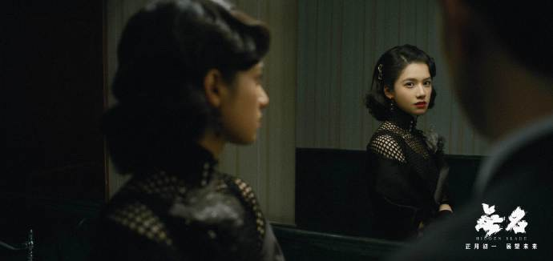

# 《无名》：捡了芝麻丢了西瓜的美学盛宴

正应了那句话：「一个人的命运啊，当然要靠自我奋斗，但是也要考虑到历史的进程。」《无名》中各式各样的人们在历史的洪流中挣扎着、奋斗着。他们付出了包括生命的一切，却在历史中连一个名字都没有留下来。
<!--more-->

《无名》是程耳在广受好评的《罗曼蒂克消亡史》之后，打磨了 6 年推出的最新电影作品。梁朝伟、王一博在本作中担纲领衔主演，黄磊、周迅、大鹏等人也饰演了重要角色。它通过对上世纪三四十年代中抗日战争中日军残忍行径的描写和对上海敌后战场殊死较量过程的再现，歌颂了在这个悲壮年代中努力挣扎着的无名英雄们。

从第一印象上讲，《无名》无论是精巧的镜头构图、纯熟的镜头语言、冷峻的主色调还是悦耳的背景音乐，无一不彰显着程耳的个人美学风格。

作为一部在大银幕上上映的作品，《无名》绝对称得上是为观众们奉上了一场视觉盛宴。在电影院中观看时，我好几次都沉迷于欣赏每一帧都可被做成海报的镜头而忘记了剧情的发展。无论是室外的优美风景，还是室内紧张的对峙，都堪称完美。

除此之外，相比于《罗曼蒂克消亡史》，程耳在《无名》中向商业化做出了极大妥协。其中最大的一点改变便是添加了两场拳拳到肉的打戏，足以令粉丝们血脉贲张。而对老牌明星（梁朝伟、周迅、黄磊）和年轻明星（王一博、张婧仪）的使用，也说明了程耳希望能吸引不同年龄层观众的希望。

然而一部好电影，除了为观众提供视听享受以外，最根本的还是要讲好一个故事，否则便是捡了芝麻丢了西瓜。首先从结构上来讲，《无名》在前半段中过于频繁使用插叙和倒叙，在勾起观众好奇心之前，便已将观众绕得云里雾里。尤其是对走进电影院的观众来讲，由于不能回放，很容易就丢失了对剧情的理解。其次从剧情上来讲，最后的反转十分牵强，甚至使得观众对前面的一些剧情产生了很多疑问。私以为，去掉这个反转也许能使的后半段发生在上海的整个故事更合乎情理。

总的来说，《无名》是一部个人风格十分强烈的作品，在观众中口碑两极分化也是很正常的。我会为他打出一个及格分，单是观赏那些优美的镜头，就已经可以值回票价了。

最后，我要为张婧仪打 call。剧中她的扮相实在是太太太太太美丽了。

